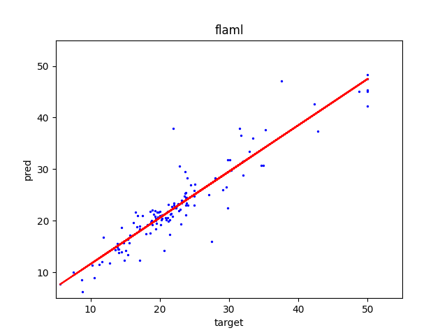

## 環境構築

1. `docker build -t <任意のタグ> .`でイメージをビルドする(ex. `docker build -t auto-ml .`)

## 実行方法

1. `docker run -v <本ディレクトリへのパス>:/work -it --rm <build時に指定した任意のタグ名> python main.py` を実行する。

2. 実行完了後に、以下を確認する。

- `./dst/result.json`に下記のようなファイルが出力される。

```
{
    "モデル名": {
        "mae": 2.1,
        "mse": 12.3,
        "pred": [
            11.2,
            ...
        ]
    }
}
```

- `./dst/モデル名/regression.png`にx軸: 目的変数, y軸: 予測結果としたプロット結果が出力される(下記のような図が出力される。)。


